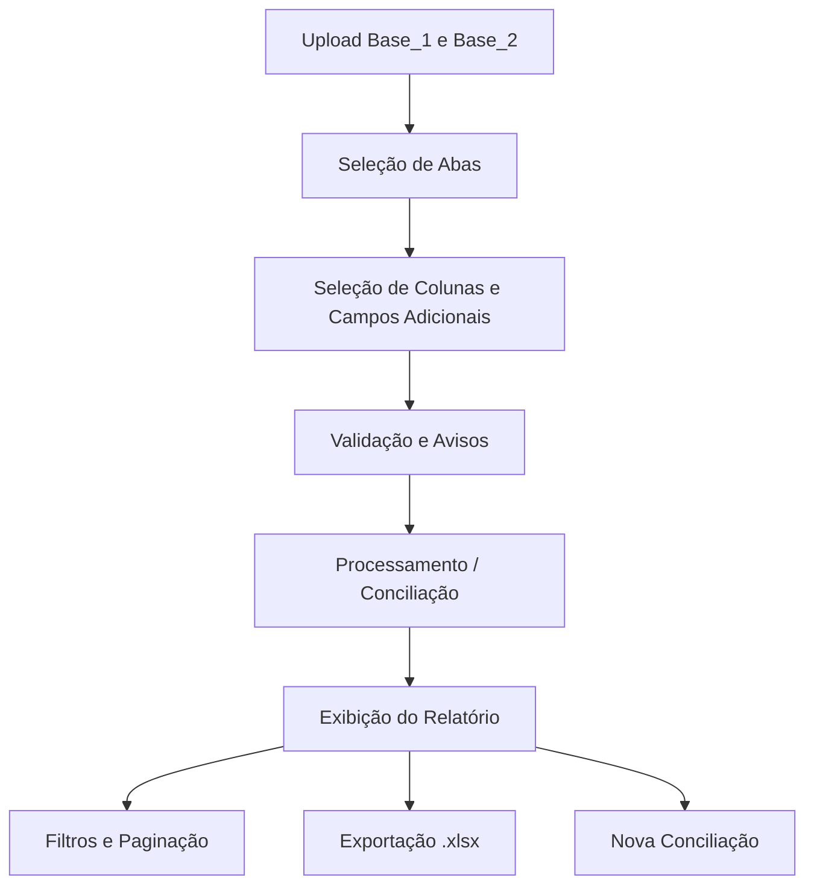
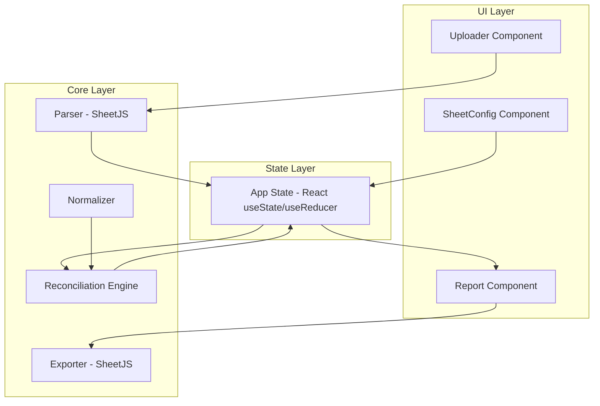
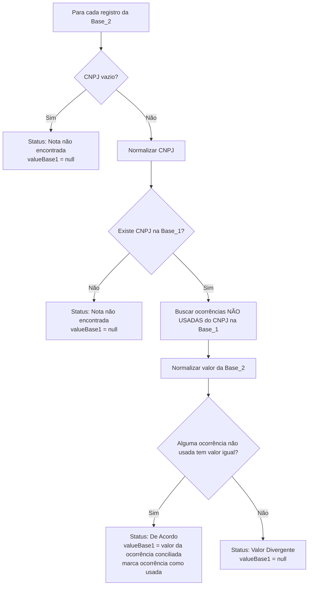

# Design Document — Excel Reconciliation

## Overview

A plataforma é uma aplicação web 100% client-side para conciliação de duas bases de dados em formato Excel. O usuário faz upload de dois arquivos, configura as colunas de conciliação (CNPJ e valor da nota), seleciona campos adicionais para exibição e obtém um relatório com o status de cada registro da Base_2 comparado contra a Base_1.

A aplicação é construída com React + TypeScript + Vite + TailwindCSS + shadcn/ui, usando SheetJS para leitura e exportação de Excel. Todo o processamento ocorre no navegador do usuário — nenhum dado é enviado a servidores externos.

O deploy é feito via Docker em VPS corporativa, com suporte a embedding via iframe em portal corporativo.

### Fluxo Principal



---

## Architecture

A arquitetura segue um modelo de camadas dentro de uma SPA React, sem backend. O processamento é síncrono no MVP, com possibilidade de migração para Web Workers em versões futuras.



### Decisões de Arquitetura

- **Client-side only**: dados sensíveis não saem do navegador; sem custo de infraestrutura; suficiente para arquivos de até 20MB / 10k registros.
- **SheetJS (xlsx)**: biblioteca madura para leitura e escrita de `.xls`/`.xlsx` no browser.
- **React state local**: para o MVP, `useState`/`useReducer` são suficientes. Sem necessidade de Redux ou Zustand.
- **Separação Core/UI**: a lógica de conciliação (`ReconciliationEngine`) é independente de React, facilitando testes unitários e futura migração para Web Workers ou backend.
- **iframe-friendly**: sem uso de `window.top`, `window.parent` ou APIs que quebram em contexto de iframe. Headers de deploy configurados para permitir embedding controlado.

---

## Components and Interfaces

### Componentes de UI

#### `<Uploader />`
Responsável pelo upload dos dois arquivos. Valida formato (`.xls`/`.xlsx`) e tamanho (≤ 20MB) antes de acionar o parser.

Props:
```typescript
interface UploaderProps {
  onFileParsed: (base: 'base1' | 'base2', file: UploadedFile) => void;
  onError: (base: 'base1' | 'base2', message: string) => void;
}
```

#### `<SheetConfig />`
Tela de configuração: seleção de aba, colunas de CNPJ e valor, e campos adicionais para exibição.

Props:
```typescript
interface SheetConfigProps {
  base1: UploadedFile;
  base2: UploadedFile;
  onConfigured: (config: ReconciliationConfig) => void;
}
```

#### `<ReportTable />`
Exibe o relatório em tabela paginada com filtros por status e resumo de contagem.

Props:
```typescript
interface ReportTableProps {
  report: ReconciliationReport;
  onExport: () => void;
  onReset: () => void;
}
```

#### `<StatusBadge />`
Componente visual para exibir o status com cor correspondente.

### Módulos Core (sem React)

#### `parser.ts`
Usa SheetJS para ler arquivos Excel e extrair abas e linhas.

```typescript
function parseFile(file: File): Promise<UploadedFile>
function getSheetHeaders(uploadedFile: UploadedFile, sheet: string): string[]
```

#### `normalizer.ts`
Normaliza valores de chave e valor antes da comparação.

```typescript
function normalizeKey(value: unknown): string
function normalizeValue(value: unknown): number | null
```

#### `reconciliationEngine.ts`
Núcleo da lógica de conciliação. Recebe as duas bases configuradas e retorna o relatório.

```typescript
function reconcile(
  base1Rows: Row[],
  base2Rows: Row[],
  config: ReconciliationConfig
): ReconciliationReport
```

#### `exporter.ts`
Gera o arquivo `.xlsx` do relatório com formatação de cores por status.

```typescript
function exportReport(report: ReconciliationReport): void
```

---

## Data Models

```typescript
// Arquivo carregado e parseado
interface UploadedFile {
  name: string;
  sheets: string[];
  rawData: Record<string, Row[]>; // sheet name → rows
}

// Linha de dados genérica
type Row = Record<string, string | number | null>;

// Configuração da conciliação
interface ReconciliationConfig {
  base1: BaseConfig;
  base2: BaseConfig;
}

interface BaseConfig {
  sheet: string;
  cnpjColumn: string;
  valueColumn: string;
  selectedDisplayFields: string[]; // campos adicionais para exibição
}

// Status possíveis de um registro
type ReconciliationStatus =
  | 'De Acordo'
  | 'Valor Divergente'
  | 'Nota não encontrada';

// Registro individual no relatório
interface ReconciliationRecord {
  cnpj: string;
  valueBase2: number | null;
  /**
   * Valor da Nota da Base_1 para este registro.
   *
   * Regras de preenchimento (decisão MVP):
   * - "De Acordo": preenchido com o valor da ocorrência conciliada na Base_1.
   * - "Valor Divergente": null — o CNPJ existe na Base_1, mas nenhuma
   *   ocorrência disponível tem o mesmo valor; não se inventa correspondência
   *   arbitrária com outro valor da Base_1.
   * - "Nota não encontrada": null — o CNPJ não existe na Base_1 (ou está vazio).
   *
   * Na exibição e exportação, null é renderizado como "—".
   */
  valueBase1: number | null;
  status: ReconciliationStatus;
  // campos adicionais: chave = "base1:NomeColuna" ou "base2:NomeColuna"
  displayFields: Record<string, string | number | null>;
}

// Relatório completo
interface ReconciliationReport {
  records: ReconciliationRecord[];
  visibleColumns: string[];
  summary: {
    total: number;
    deAcordo: number;
    divergente: number;
    naoEncontrada: number;
  };
  generatedAt: Date;
}

// Estado global da aplicação
type AppStep = 'upload' | 'config' | 'processing' | 'report';

interface AppState {
  step: AppStep;
  base1: UploadedFile | null;
  base2: UploadedFile | null;
  config: ReconciliationConfig | null;
  report: ReconciliationReport | null;
  errors: Record<string, string>;
  warnings: string[];
}
```

### Algoritmo de Conciliação

O algoritmo central opera sobre os registros da Base_2 e tenta encontrar correspondência na Base_1:



**Estratégia de matching com múltiplas ocorrências:**
- A Base_1 é indexada por CNPJ normalizado em um `Map<string, Row[]>`.
- Para cada registro da Base_2, busca-se todas as ocorrências **ainda não utilizadas** do CNPJ na Base_1.
- Tenta-se encontrar uma ocorrência com valor igual (após normalização). Se encontrada, essa ocorrência é marcada como "usada" para evitar double-matching, e `valueBase1` recebe o valor dessa ocorrência.
- Se nenhuma ocorrência não utilizada tiver valor igual, o status é "Valor Divergente" e `valueBase1` é definido como `null` — sem inventar correspondência arbitrária com outro valor da Base_1.
- Se o CNPJ não existir na Base_1 (ou estiver vazio), o status é "Nota não encontrada" e `valueBase1` é `null`.

**Preenchimento de `valueBase1` — resumo das regras:**

| Status | `valueBase1` |
|--------|-------------|
| De Acordo | valor da ocorrência conciliada na Base_1 |
| Valor Divergente | `null` (exibido como "—") |
| Nota não encontrada | `null` (exibido como "—") |

---

## Correctness Properties

*A property is a characteristic or behavior that should hold true across all valid executions of a system — essentially, a formal statement about what the system should do. Properties serve as the bridge between human-readable specifications and machine-verifiable correctness guarantees.*

### Property 1: Validação de formato e tamanho de arquivo

*Para qualquer* arquivo cujo nome não termine em `.xls` ou `.xlsx`, ou cujo tamanho seja superior a 20MB, o sistema deve rejeitar o upload e nunca tentar parsear o arquivo.

**Validates: Requirements 1.1, 1.2, 1.3**

---

### Property 2: Normalização de chave é idempotente

*Para qualquer* valor de CNPJ (incluindo strings com espaços, letras maiúsculas e caracteres unicode), aplicar `normalizeKey` deve remover espaços nas bordas e converter para minúsculas, e aplicar `normalizeKey` duas vezes deve produzir o mesmo resultado que aplicar uma vez.

**Validates: Requirements 4.1, 4.2**

---

### Property 3: Normalização de valor produz número ou nulo

*Para qualquer* valor de entrada, `normalizeValue` deve retornar um número finito com no máximo 2 casas decimais ou `null` — nunca uma string, `NaN`, `Infinity` ou `undefined`.

**Validates: Requirements 4.3, 4.4**

---

### Property 4: Parser extrai abas e cabeçalhos corretamente

*Para qualquer* arquivo Excel válido com N abas, o parser deve retornar exatamente N nomes de abas; e para qualquer aba com dados, os cabeçalhos retornados devem corresponder exatamente à primeira linha dessa aba.

**Validates: Requirements 2.1, 2.3**

---

### Property 5: Todo registro válido da Base_2 aparece no relatório

*Para qualquer* configuração válida e qualquer conjunto de registros da Base_2, o número de registros no relatório deve ser igual ao número de registros da Base_2 (incluindo os com CNPJ vazio, que recebem status "Nota não encontrada").

**Validates: Requirements 5.3, 7.3**

---

### Property 6: Status é exaustivo, mutuamente exclusivo e semanticamente correto com anti-double-matching

*Para qualquer* par de bases e configuração válida, cada registro no relatório deve ter exatamente um dos três status possíveis, e esse status deve ser semanticamente correto considerando apenas as ocorrências da Base_1 ainda não utilizadas no momento do matching:

- `'Nota não encontrada'` se e somente se o CNPJ normalizado não existe na Base_1 (ou CNPJ está vazio);
- `'De Acordo'` se e somente se existe ao menos uma ocorrência **ainda não utilizada** na Base_1 com mesmo CNPJ e mesmo valor normalizado — após o match, essa ocorrência é marcada como usada e não pode ser reutilizada para outro registro da Base_2;
- `'Valor Divergente'` se e somente se o CNPJ existe na Base_1 mas nenhuma ocorrência **disponível (não utilizada)** tem valor igual após normalização.

**Validates: Requirements 6.4, 6.5, 6.6, 7.1**

---

### Property 7: Campos adicionais não afetam o status

*Para qualquer* par de bases e configuração, alterar os `selectedDisplayFields` (sem alterar as colunas de CNPJ ou valor) não deve modificar o `status` de nenhum registro no relatório.

**Validates: Requirements 3.5, 7.2**

---

### Property 8: Completude de matching com múltiplas ocorrências

*Para qualquer* Base_2 com múltiplas ocorrências do mesmo CNPJ, cada ocorrência deve gerar uma linha independente no relatório, e o matching contra a Base_1 deve considerar todas as ocorrências disponíveis (não apenas a primeira).

**Validates: Requirements 5.2, 5.3, 6.2, 6.3**

---

### Property 9: Round-trip de exportação preserva dados e formato de colunas

*Para qualquer* relatório gerado, o arquivo `.xlsx` exportado deve: (a) conter exatamente o mesmo número de registros que `report.records`; (b) incluir as colunas na ordem exata: CNPJ, Valor da Nota (Base_2), Valor da Nota (Base_1), Status; (c) incluir todos os campos adicionais selecionados após as colunas padrão; e (d) ao re-importar o arquivo, os valores de CNPJ, Valor da Nota (Base_2), Valor da Nota (Base_1) e Status devem ser equivalentes aos originais.

**Validates: Requirements 10.1, 10.2, 10.3**

---

### Property 10: Resumo é consistente com os registros visíveis

*Para qualquer* relatório e qualquer filtro de status ativo, a soma dos contadores do resumo deve ser igual ao número de registros visíveis, e cada contador deve corresponder à contagem real dos registros com aquele status no conjunto visível.

**Validates: Requirements 8.2, 9.4**

---

### Property 11: Filtro por status retorna apenas registros corretos

*Para qualquer* relatório e qualquer filtro de status ativo (incluindo "Todos"), todos os registros visíveis devem ter exatamente o status filtrado; quando o filtro for "Todos", todos os registros do relatório devem ser visíveis.

**Validates: Requirements 9.2, 9.3**

---

### Property 12: Paginação é correta para relatórios grandes

*Para qualquer* relatório com N registros, quando N > 500, o número de páginas deve ser `Math.ceil(N / 100)`, cada página deve conter no máximo 100 registros, e a união de todas as páginas deve conter exatamente os N registros originais sem duplicatas.

**Validates: Requirements 8.4**

---

### Property 13: valueBase1 é preenchido corretamente conforme o status

*Para qualquer* par de bases e configuração válida, o campo `valueBase1` de cada registro no relatório deve obedecer às seguintes regras:
- Se o status for `'De Acordo'`, `valueBase1` deve ser igual ao valor normalizado da ocorrência da Base_1 que foi conciliada (não nulo).
- Se o status for `'Valor Divergente'` ou `'Nota não encontrada'`, `valueBase1` deve ser `null`.

**Validates: Requirements 7.4, 8.5**

---

## Error Handling

| Situação | Componente | Comportamento |
|----------|-----------|---------------|
| Formato de arquivo inválido | Uploader | Exibe mensagem, bloqueia processamento |
| Arquivo > 20MB | Uploader | Exibe mensagem, bloqueia processamento |
| Arquivo corrompido / ilegível | Parser | Exibe mensagem, bloqueia processamento |
| Aba vazia ou sem cabeçalhos | Parser | Exibe mensagem, solicita nova seleção |
| Mesma coluna para CNPJ e Valor | SheetConfig | Exibe mensagem de validação, bloqueia |
| CNPJ vazio na Base_2 | ReconciliationEngine | Registro recebe status "Nota não encontrada", valueBase1 = null |
| CNPJ vazio na Base_1 | ReconciliationEngine | Registro ignorado silenciosamente |
| Valor não numérico | Normalizer | `normalizeValue` retorna `null` → status "Valor Divergente", valueBase1 = null |
| CNPJ duplicado na Base_1 | ReconciliationEngine | Aviso exibido; usa estratégia de matching por valor com anti-double-matching |
| Base_2 sem registros válidos | ReconciliationEngine | Relatório vazio com mensagem informativa |
| Arquivo com apenas cabeçalho | Parser | Relatório vazio com mensagem informativa |

### Estratégia de Erros na UI

- Erros de upload são exibidos inline abaixo do componente de upload correspondente.
- Erros de configuração são exibidos próximos ao campo inválido.
- Avisos (ex: CNPJs duplicados) são exibidos em um banner amarelo antes do botão "Conciliar".
- Erros fatais de processamento são exibidos em um modal com opção de reiniciar.

---

## Testing Strategy

### Abordagem Dual

A estratégia combina testes unitários (exemplos concretos e casos de borda) com testes baseados em propriedades (cobertura ampla via geração aleatória de inputs).

### Testes Unitários

Focados em:
- Exemplos concretos de normalização (CNPJ com espaços, letras maiúsculas, valores com vírgula)
- Casos de borda: arquivo vazio, aba sem cabeçalho, CNPJ nulo, valor não numérico
- Integração entre Parser → ReconciliationEngine → Exporter
- Validações de UI (formato inválido, tamanho excedido, mesma coluna para chave e valor)
- Verificação explícita de que `valueBase1` é `null` para status "Valor Divergente" e "Nota não encontrada"
- Verificação de que uma ocorrência da Base_1 usada em um match não é reutilizada (anti-double-matching)

### Testes Baseados em Propriedades (PBT)

**Biblioteca**: [fast-check](https://github.com/dubzzz/fast-check) (TypeScript/JavaScript)

**Configuração**: mínimo de 100 iterações por propriedade (`numRuns: 100`).

Cada teste de propriedade deve referenciar a propriedade do design com o seguinte formato de tag:

```
// Feature: excel-reconciliation, Property N: <texto da propriedade>
```

**Mapeamento de propriedades para testes PBT:**

| Propriedade | Tipo de Teste | Geradores Necessários |
|-------------|--------------|----------------------|
| Property 1: Validação de formato e tamanho | PBT | `fc.string()` para extensões, `fc.integer()` para tamanhos |
| Property 2: Normalização de chave idempotente | PBT | `fc.string()`, `fc.unicodeString()` |
| Property 3: Normalização de valor produz número ou nulo | PBT | `fc.anything()` |
| Property 4: Parser extrai abas e cabeçalhos | PBT | `fc.array(fc.string())` para nomes de abas/colunas |
| Property 5: Todo registro válido da Base_2 aparece | PBT | `fc.array(rowArbitrary)` |
| Property 6: Status exaustivo, semântico e anti-double-matching | PBT | `fc.array(rowArbitrary)` x2 com CNPJs repetidos |
| Property 7: Campos adicionais não afetam status | PBT | `fc.array(fc.string())` para displayFields |
| Property 8: Completude de matching com múltiplas ocorrências | PBT | `fc.array(rowArbitrary)` com CNPJs repetidos |
| Property 9: Round-trip de exportação | PBT | `reportArbitrary` |
| Property 10: Resumo consistente com registros visíveis | PBT | `reportArbitrary`, `fc.constantFrom(statuses)` |
| Property 11: Filtro retorna apenas registros corretos | PBT | `reportArbitrary`, `fc.constantFrom(statuses)` |
| Property 12: Paginação correta para relatórios grandes | PBT | `fc.integer({ min: 501, max: 10000 })` para N |
| Property 13: valueBase1 preenchido conforme status | PBT | `fc.array(rowArbitrary)` x2 |

### Cobertura Esperada

- `normalizer.ts`: 100% via PBT (Properties 2 e 3)
- `reconciliationEngine.ts`: 100% via PBT (Properties 5–8, 13) + testes unitários de anti-double-matching
- `exporter.ts`: Properties 9 via PBT + testes unitários de formatação de cores
- `parser.ts`: testes unitários com fixtures de arquivos reais + Property 4
- Componentes React: testes unitários com React Testing Library para fluxos principais (Properties 10, 11, 12)
